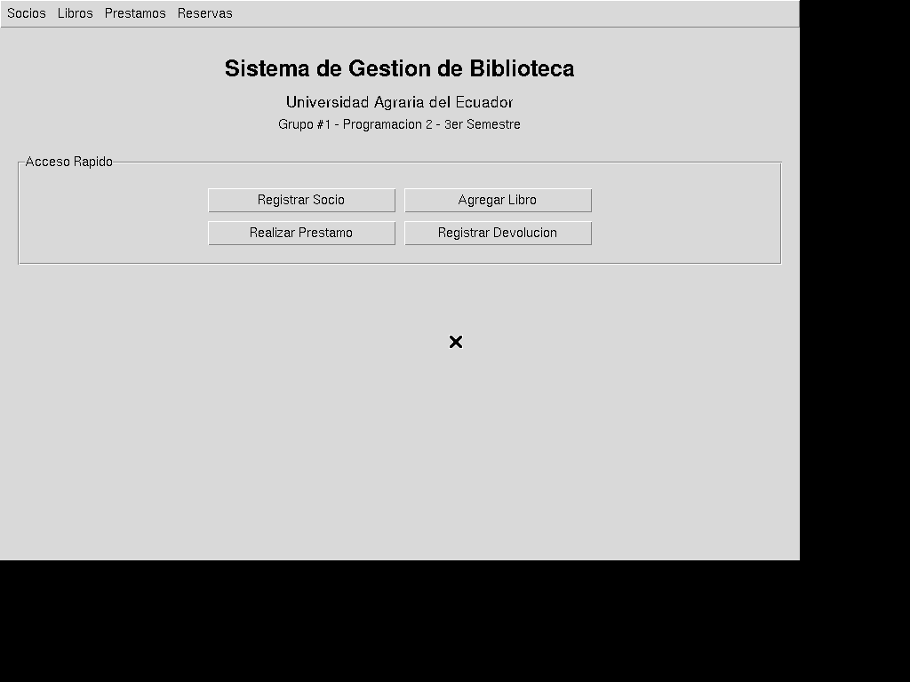
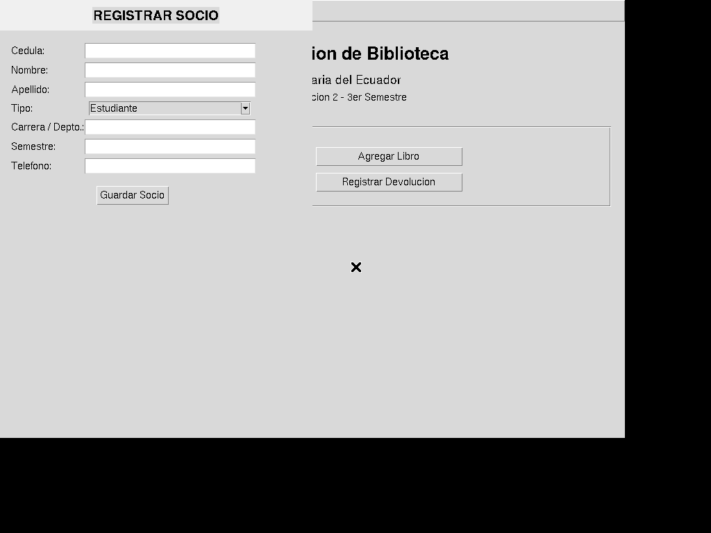
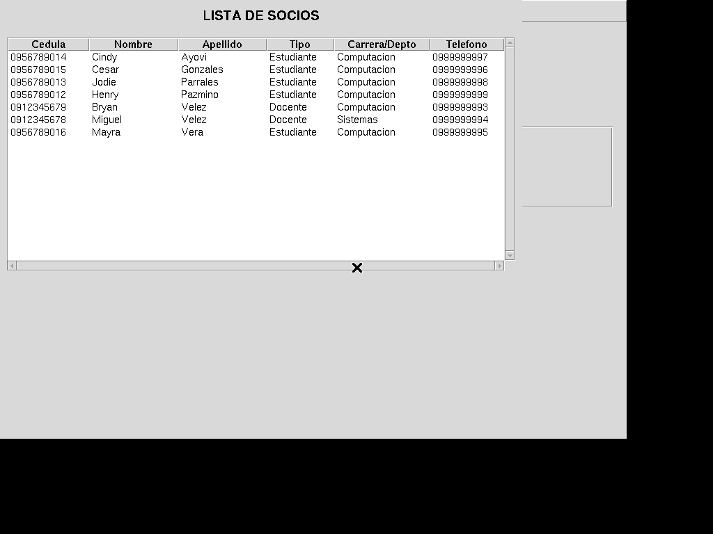
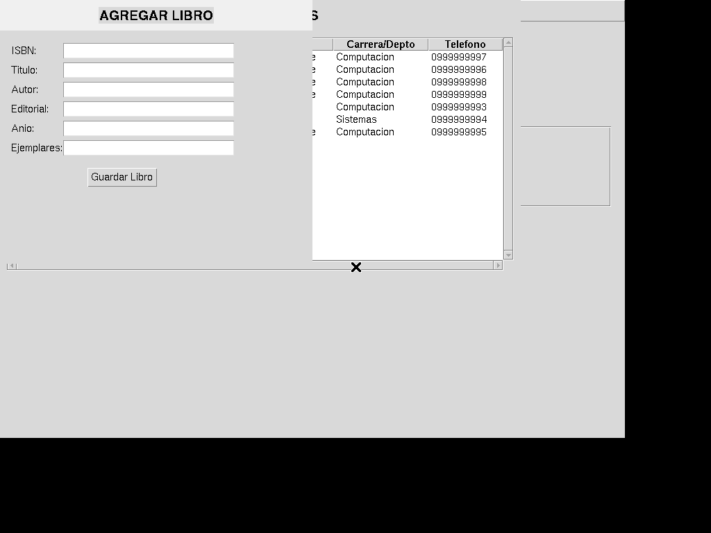
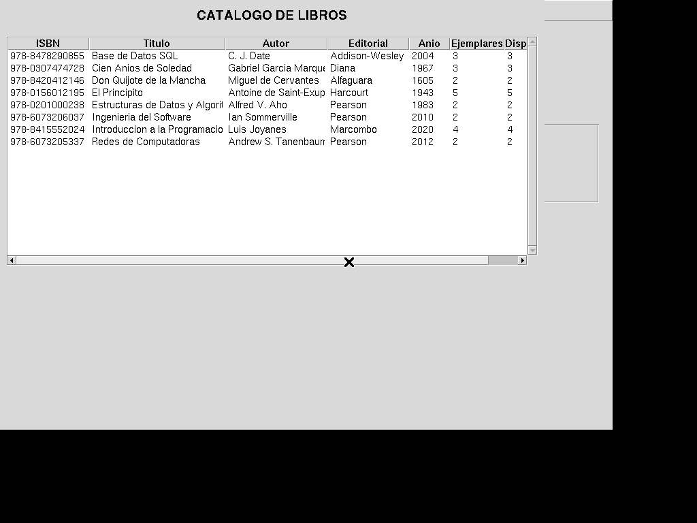
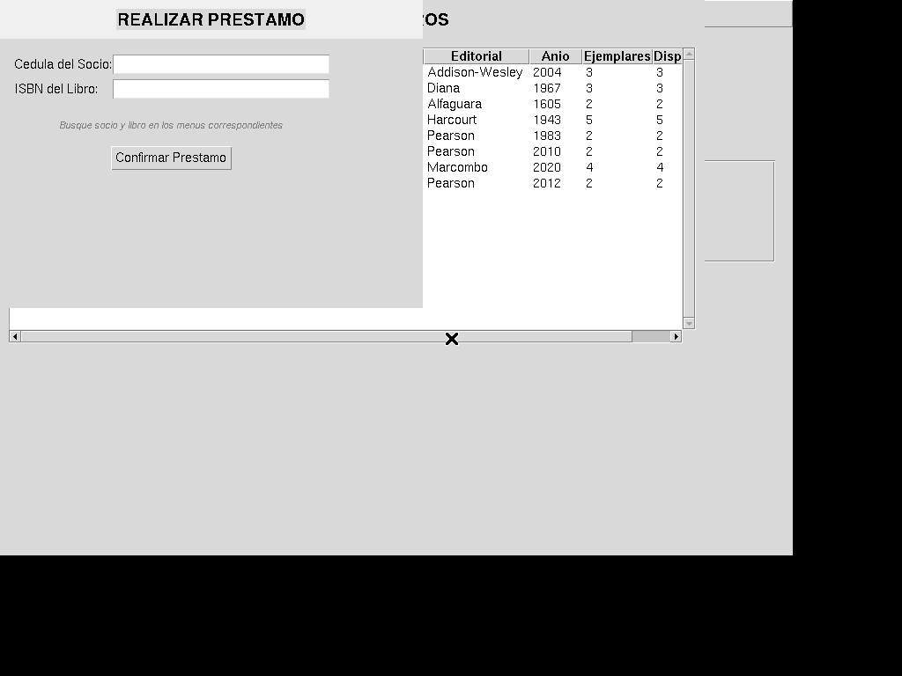
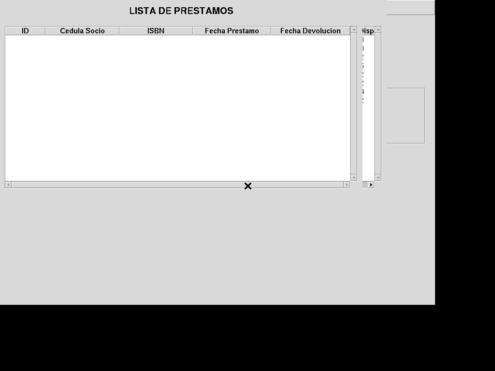
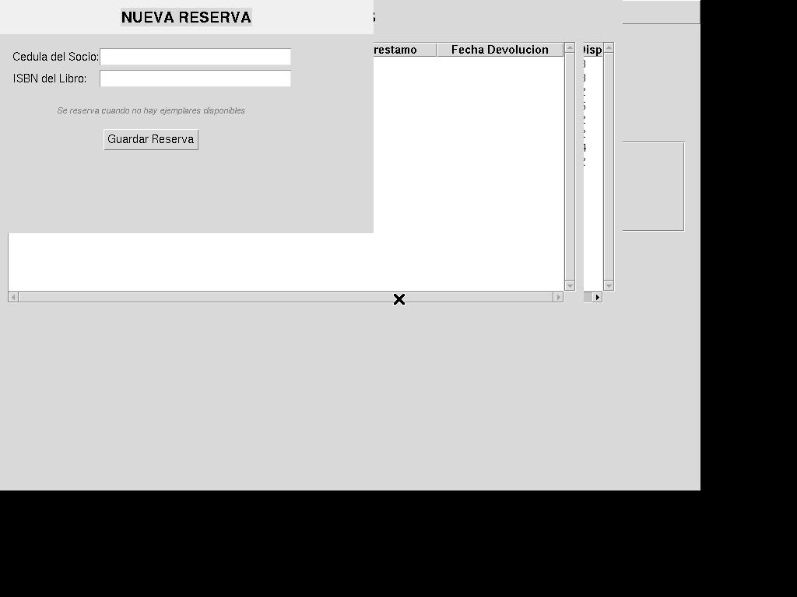

# Manual de Usuario — Sistema de Gestión de Biblioteca Universitaria

*Documentación elaborada por: **Mayra Vera** (Documentación y Pruebas)*

**Grupo #1 — Lenguaje de Programación 2**
**Versión:** 1.0 — Entrega Final
**Última actualización:** 20 de julio de 2026

---

## 1. Introducción

El Sistema de Gestión de Biblioteca Universitaria es una aplicación de escritorio desarrollada en Python que permite administrar los recursos bibliográficos de una biblioteca física universitaria. El sistema facilita el registro de socios (estudiantes y docentes), la gestión del catálogo de libros, el control de préstamos y devoluciones, y la administración de reservas cuando un libro no está disponible.

El sistema fue desarrollado utilizando:
- **Python 3.11+** como lenguaje de programación
- **Tkinter** para la interfaz gráfica de usuario
- **SQLite3** como base de datos embebida
- **Git + GitHub** para el control de versiones colaborativo

---

## 2. Requisitos del Sistema

### 2.1 Hardware
- Computadora con sistema operativo Windows 10/11, Linux o macOS
- Resolución de pantalla mínima: 1024 × 768 píxeles
- Espacio en disco: 50 MB libres
- Conexión a internet (solo para clonar el repositorio)

### 2.2 Software
- Python 3.11 o superior ([descargar](https://www.python.org/downloads/))
- SQLite3 (incluido en Python por defecto)
- Tkinter (incluido en Python por defecto desde la versión 3.x)
- Git (opcional, solo para clonar el repositorio)
- DB Browser for SQLite (opcional, para administración visual de la base de datos)

### 2.3 Verificar instalación de Python
Antes de instalar el sistema, verifique que Python esté correctamente instalado:

1. Abrir una terminal (CMD en Windows, Terminal en macOS/Linux)
2. Escriba: `python --version`
3. Debe mostrar: `Python 3.11.x` o superior

---

## 3. Instalación

### 3.1 Descargar el proyecto

**Opción 1 — Clonar con Git (recomendado):**
```bash
git clone https://github.com/josuepaz80-usitee/sistema-biblioteca-prog2.git
cd sistema-biblioteca-prog2
```

**Opción 2 — Descargar ZIP:**
1. Ir a https://github.com/josuepaz80-usitee/sistema-biblioteca-prog2
2. Hacer clic en el botón verde **"<> Code"** → **"Download ZIP"**
3. Descomprimir el archivo en una carpeta de su PC

### 3.2 Crear la base de datos

Ejecute el siguiente comando en la terminal dentro de la carpeta del proyecto:

```bash
python seed.py
```

Este comando crea el archivo `db/biblioteca.db` con:
- 7 socios de prueba (estudiantes y docentes)
- 8 libros en el catálogo
- Sin préstamos ni reservas registrados

### 3.3 Iniciar el sistema

```bash
python main.py
```

Aparecerá la ventana principal del sistema lista para usar.

> **Nota:** Si aparece un error de `ModuleNotFoundError: No module named 'tkinter'`, instale Tkinter:
> - **Windows/macOS:** Viene incluido con Python. Reinstale Python y asegúrese de marcar la casilla "tcl/tk and IDLE".
> - **Linux (Debian/Ubuntu):** `sudo apt install python3-tk`
> - **Linux (Fedora):** `sudo dnf install python3-tkinter`

---

## 3. Instalación

### 3.1 Descargar el proyecto

**Opción 1 — Clonar con Git (recomendado):**
```bash
git clone https://github.com/josuepaz80-usitee/sistema-biblioteca-prog2.git
cd sistema-biblioteca-prog2
```

**Opción 2 — Descargar ZIP:**
1. Ir a https://github.com/josuepaz80-usitee/sistema-biblioteca-prog2
2. Hacer clic en el botón verde **"<> Code"** → **"Download ZIP"**
3. Descomprimir el archivo en una carpeta de su PC

### 3.2 Crear la base de datos

Ejecute el siguiente comando en la terminal dentro de la carpeta del proyecto:

```bash
python seed.py
```

Este comando crea el archivo `db/biblioteca.db` con:
- 7 socios de prueba (estudiantes y docentes)
- 8 libros en el catálogo
- Sin préstamos ni reservas registrados

### 3.3 Iniciar el sistema

```bash
python main.py
```

Aparecerá la ventana principal del sistema lista para usar.

> **Nota:** Si aparece un error de `ModuleNotFoundError: No module named 'tkinter'`, instale Tkinter:
> - **Windows/macOS:** Viene incluido con Python. Reinstale Python y asegúrese de marcar la casilla "tcl/tk and IDLE".
> - **Linux (Debian/Ubuntu):** `sudo apt install python3-tk`
> - **Linux (Fedora):** `sudo dnf install python3-tkinter`

---

## 4. Guía de Uso

### 4.1 Pantalla Principal

Al ejecutar `main.py`, se muestra la ventana principal del sistema. Esta ventana contiene:

```
┌─────────────────────────────────────────────────────┐
│  Socios │ Libros │ Préstamos │ Reservas             │  ← Menú superior
├─────────────────────────────────────────────────────┤
│                                                     │
│         SISTEMA DE GESTIÓN DE BIBLIOTECA            │
│              Universidad Agraria del Ecuador         │
│              Grupo #1 - Programación 2               │
│                                                     │
│              ┌─────────────────────┐                 │
│              │   ACCESO RÁPIDO     │                 │
│              ├─────────────────────┤                 │
│  [Registrar Socio]  [Agregar Libro]                  │
│  [Realizar Préstamo] [Registrar Devolución]          │
│              └─────────────────────┘                 │
│                                                     │
└─────────────────────────────────────────────────────┘
```

****
*Imagen 1: Pantalla principal del sistema con menú superior y panel de acceso rápido.*

#### Barra de menú

La barra de menú en la parte superior contiene cuatro secciones:

| Menú | Opciones | Descripción |
|------|----------|-------------|
| **Socios** | Registrar Socio | Abre formulario para registrar un nuevo socio |
| | Listar Socios | Muestra tabla con todos los socios registrados |
| **Libros** | Agregar Libro | Abre formulario para agregar un libro al catálogo |
| | Ver Catálogo | Muestra tabla con todos los libros disponibles |
| **Préstamos** | Realizar Préstamo | Abre formulario para registrar un préstamo |
| | Registrar Devolución | Abre formulario para registrar una devolución |
| | Ver Préstamos | Muestra tabla con el historial de préstamos |
| **Reservas** | Nueva Reserva | Abre formulario para crear una reserva |
| | Ver Reservas | Muestra tabla con reservas activas |

#### Panel de Acceso Rápido

La pantalla principal incluye botones de acceso rápido para las operaciones más frecuentes:
- **Registrar Socio**: acceso directo al formulario de registro de socios
- **Agregar Libro**: acceso directo al formulario de registro de libros
- **Realizar Préstamo**: acceso directo al formulario de préstamos
- **Registrar Devolución**: acceso directo al formulario de devoluciones

---

### 4.2 Gestión de Socios

#### Registrar un nuevo socio

1. Haga clic en **Socios → Registrar Socio** o en el botón **Registrar Socio** del panel de acceso rápido.
2. Complete los siguientes campos en el formulario:

| Campo | Descripción | Obligatorio |
|-------|-------------|:-----------:|
| **Cédula** | Número de identificación del socio | ✅ Sí |
| **Nombre** | Nombre(s) del socio | ✅ Sí |
| **Apellido** | Apellido(s) del socio | ✅ Sí |
| **Tipo** | Seleccionar: "Estudiante" o "Docente" | ✅ Sí |
| **Carrera / Depto.** | Carrera (estudiante) o departamento (docente) | ❌ No |
| **Semestre** | Semestre actual (solo estudiantes) | ❌ No |
| **Teléfono** | Número de contacto | ❌ No |

3. Haga clic en **Guardar Socio**.
4. Aparecerá un mensaje de confirmación: *"Socio registrado correctamente"*.

****
*Imagen 2: Formulario para registrar un nuevo socio.*

#### Listar socios registrados

1. Haga clic en **Socios → Listar Socios**.
2. Se abrirá una ventana con una tabla que muestra todos los socios registrados.
3. La tabla incluye: Cédula, Nombre, Apellido, Tipo (Estudiante/Docente), Carrera/Depto. y Teléfono.
4. Use las barras de desplazamiento para ver todos los registros.

****
*Imagen 3: Ventana con la lista de socios registrados.*

---

### 4.3 Gestión de Libros

#### Agregar un nuevo libro

1. Haga clic en **Libros → Agregar Libro** o en el botón **Agregar Libro** del panel de acceso rápido.
2. Complete los siguientes campos:

| Campo | Descripción | Obligatorio |
|-------|-------------|:-----------:|
| **ISBN** | Código ISBN del libro | ✅ Sí |
| **Título** | Título completo del libro | ✅ Sí |
| **Autor** | Autor(es) del libro | ✅ Sí |
| **Editorial** | Editorial que publicó el libro | ❌ No |
| **Año** | Año de publicación | ❌ No |
| **Ejemplares** | Cantidad de ejemplares (por defecto: 1) | ❌ No |

3. Haga clic en **Guardar Libro**.
4. Aparecerá un mensaje de confirmación: *"Libro agregado correctamente"*.

****
*Imagen 4: Formulario para agregar un nuevo libro al catálogo.*

#### Ver catálogo de libros

1. Haga clic en **Libros → Ver Catálogo**.
2. Se abrirá una ventana con una tabla que muestra todos los libros.
3. La tabla incluye: ISBN, Título, Autor, Editorial, Año, Ejemplares totales y Disponibles.
4. Los campos "Disponibles" se actualizan automáticamente al realizar préstamos o devoluciones.

****
*Imagen 5: Ventana con el catálogo completo de libros.*

---

### 4.4 Préstamos y Devoluciones

#### Realizar un préstamo

1. Haga clic en **Préstamos → Realizar Préstamo** o en el botón del panel de acceso rápido.
2. Ingrese:
   - **Cédula del Socio**: número de identificación del socio que solicita el préstamo
   - **ISBN del Libro**: código ISBN del libro a prestar
3. El sistema valida automáticamente:
   - Que el socio exista en la base de datos
   - Que el libro exista en el catálogo
   - Que haya ejemplares disponibles
4. Haga clic en **Confirmar Préstamo**.
5. Un mensaje confirmará: *"Préstamo registrado correctamente"*.
6. El sistema reduce automáticamente los ejemplares disponibles del libro.

> **Importante:** Si el libro no tiene ejemplares disponibles, el sistema mostrará un mensaje de error. En ese caso, puede crear una reserva (ver sección 4.5).

****
*Imagen 6: Formulario para registrar un préstamo.*

#### Registrar una devolución

1. Haga clic en **Préstamos → Registrar Devolución** o en el botón del panel de acceso rápido.
2. Ingrese:
   - **ID del Préstamo**: el número de identificación del préstamo (consulte en "Ver Préstamos")
   - **ISBN del Libro**: código ISBN del libro que se devuelve
3. El sistema verifica que el préstamo exista y esté pendiente.
4. Haga clic en **Confirmar Devolución**.
5. Un mensaje confirmará: *"Devolución registrada correctamente"*.
6. El sistema incrementa automáticamente los ejemplares disponibles del libro.

#### Ver historial de préstamos

1. Haga clic en **Préstamos → Ver Préstamos**.
2. Se abrirá una ventana con una tabla que muestra todos los préstamos registrados.
3. La tabla incluye: ID, Cédula del Socio, ISBN, Fecha de Préstamo y Fecha de Devolución.
4. Los préstamos pendientes muestran "Pendiente" en la columna de fecha de devolución.

****
*Imagen 7: Ventana con el historial de préstamos.*

---

### 4.5 Reservas

#### Crear una nueva reserva

1. Haga clic en **Reservas → Nueva Reserva**.
2. Ingrese:
   - **Cédula del Socio**: número de identificación del socio
   - **ISBN del Libro**: código ISBN del libro que desea reservar
3. Haga clic en **Guardar Reserva**.
4. Un mensaje confirmará: *"Reserva registrada correctamente"*.
5. La reserva queda en estado "Activa" hasta que se cancele manualmente.

****
*Imagen 8: Formulario para crear una nueva reserva.*

#### Ver reservas activas

1. Haga clic en **Reservas → Ver Reservas**.
2. Se abrirá una ventana con una tabla que muestra todas las reservas activas.
3. La tabla incluye: ID, Cédula del Socio, ISBN, Fecha de Reserva y Estado (Activa/No).
4. Las reservas se muestran en orden FIFO (el primero en reservar aparece primero).

---

## 5. Estructura de la Base de Datos

El sistema utiliza SQLite con 4 tablas relacionadas mediante claves foráneas:

### Diagrama Entidad-Relación

```
┌─────────────────┐       ┌──────────────────┐
│     socios      │       │     libros       │
├─────────────────┤       ├──────────────────┤
│ PK cedula       │       │ PK isbn          │
│ nombre          │       │ titulo           │
│ apellido        │       │ autor            │
│ tipo            │       │ editorial        │
│ carrera_depto   │       │ anio             │
│ semestre        │       │ ejemplares       │
│ telefono        │       │ disponibles      │
└────────┬────────┘       └────────┬─────────┘
         │                         │
         │ FK                      │ FK
         ▼                         ▼
┌──────────────────────────────────────────┐
│              prestamos                   │
├──────────────────────────────────────────┤
│ PK id (autoincrement)                    │
│ FK cedula_socio → socios(cedula)        │
│ FK isbn_libro → libros(isbn)            │
│ fecha_prestamo                          │
│ fecha_devolucion (NULL = pendiente)      │
└──────────────────────────────────────────┘

┌──────────────────────────────────────────┐
│              reservas                     │
├──────────────────────────────────────────┤
│ PK id (autoincrement)                    │
│ FK cedula_socio → socios(cedula)        │
│ FK isbn_libro → libros(isbn)            │
│ fecha_reserva                            │
│ activa (1 = activa, 0 = cancelada)       │
└──────────────────────────────────────────┘
```

### Detalle de tablas

#### socios
| Columna | Tipo | Descripción |
|---------|------|-------------|
| cedula | TEXT PK | Número de identificación |
| nombre | TEXT NOT NULL | Nombre del socio |
| apellido | TEXT NOT NULL | Apellido del socio |
| tipo | TEXT CHECK | 'Estudiante' o 'Docente' |
| carrera_departamento | TEXT | Carrera o departamento |
| semestre | INTEGER | Semestre (solo estudiantes) |
| telefono | TEXT | Teléfono de contacto |

#### libros
| Columna | Tipo | Descripción |
|---------|------|-------------|
| isbn | TEXT PK | Código ISBN del libro |
| titulo | TEXT NOT NULL | Título del libro |
| autor | TEXT NOT NULL | Autor del libro |
| editorial | TEXT | Editorial |
| anio | INTEGER | Año de publicación |
| ejemplares | INTEGER DEFAULT 1 | Cantidad total de ejemplares |
| disponibles | INTEGER DEFAULT 1 | Ejemplares disponibles para préstamo |

#### prestamos
| Columna | Tipo | Descripción |
|---------|------|-------------|
| id | INTEGER PK AUTOINCREMENT | Identificador único |
| cedula_socio | TEXT FK → socios | Socio que realiza el préstamo |
| isbn_libro | TEXT FK → libros | Libro prestado |
| fecha_prestamo | TEXT NOT NULL | Fecha del préstamo |
| fecha_devolucion | TEXT | Fecha de devolución (NULL = pendiente) |

#### reservas
| Columna | Tipo | Descripción |
|---------|------|-------------|
| id | INTEGER PK AUTOINCREMENT | Identificador único |
| cedula_socio | TEXT FK → socios | Socio que reserva |
| isbn_libro | TEXT FK → libros | Libro reservado |
| fecha_reserva | TEXT NOT NULL | Fecha de la reserva |
| activa | INTEGER DEFAULT 1 | 1 = activa, 0 = cancelada |

---

## 6. Solución de Problemas

| Problema | Causa probable | Solución |
|----------|---------------|----------|
| **Error: "No module named 'tkinter'"** | Tkinter no está instalado | Ver paso 3.3 — instalar python3-tk según su SO |
| **Error: "No such table: socios"** | Base de datos no creada | Ejecutar `python seed.py` para crear la BD |
| **Error: "Socio no encontrado"** | Cédula incorrecta o socio no registrado | Verificar la cédula o registrar primero al socio |
| **Error: "No hay ejemplares disponibles"** | Todos los ejemplares están prestados | Usar la función de reserva (sección 4.5) |
| **Error: "UNIQUE constraint failed"** | Cédula o ISBN ya existe | No se puede duplicar un socio o libro |
| **La aplicación no inicia** | Python no está en el PATH | Verificar instalación de Python y PATH |
| **Los cambios no se guardan** | Falta commit() en la BD | El sistema hace commit automático (contactar al desarrollador) |
| **La ventana se ve pequeña** | Resolución baja | El sistema usa 900×600 píxeles |
| **No veo todos los registros en la tabla** | Ventana muy pequeña | Maximizar la ventana o usar scrollbars |

---

## 7. Preguntas Frecuentes (FAQ)

**1. ¿Puedo usar el sistema sin conexión a internet?**
Sí. El sistema funciona completamente offline. Solo necesita internet para descargar los archivos iniciales.

**2. ¿Los datos se pierden si cierro la aplicación?**
No. Todos los datos se guardan automáticamente en el archivo `db/biblioteca.db`.

**3. ¿Puedo tener varios usuarios usando el sistema al mismo tiempo?**
No. El sistema está diseñado para un solo usuario bibliotecario. Para múltiples usuarios simultáneos, se requeriría migrar a una base de datos cliente-servidor.

**4. ¿Cómo hago una copia de seguridad de los datos?**
Copie el archivo `db/biblioteca.db` a otra ubicación. Para restaurar, reemplácelo en la misma carpeta.

**5. ¿Puedo agregar más socios o libros de prueba?**
Sí. Edite el archivo `seed.py` y agregue más datos siguiendo el mismo formato. Luego elimine `db/biblioteca.db` y ejecute `python seed.py` nuevamente.

**6. ¿Necesito conocimientos de programación para usar el sistema?**
No. La interfaz gráfica permite realizar todas las operaciones sin escribir código.

**7. ¿Qué hago si el sistema se congela?**
Cierre la ventana y vuelva a ejecutar `python main.py`. Los datos no se pierden porque se guardan en la BD.

**8. ¿El sistema funciona en cualquier idioma?**
Actualmente la interfaz está en español. Para cambiar el idioma, se requeriría modificar los textos en el código fuente.

---

## 8. Contacto y Soporte

Para reportar errores o sugerir mejoras, abra un issue en el repositorio de GitHub:
https://github.com/josuepaz80-usitee/sistema-biblioteca-prog2

---

> *Manual de Usuario — Versión 1.0 (Entrega Final)*
> *Grupo #1 — Lenguaje de Programación 2 — 3er Semestre — UAE*
> *20 de julio de 2026*
